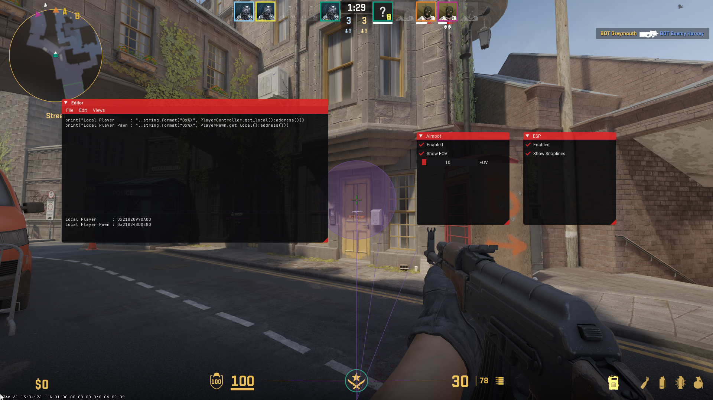

# aether
Experimental Counter-Strike 2 cheat

## Features
- Basic aimbot without visibility check
  - FOV constraint
- Snapline ESP
- [Lua scripting system](./src/scripts)

## Building
You need CMake to build this project ([download](https://cmake.org/download))

```sh
cmake -B build                        # build the solution
cmake --build build --config Release  # compile
```


